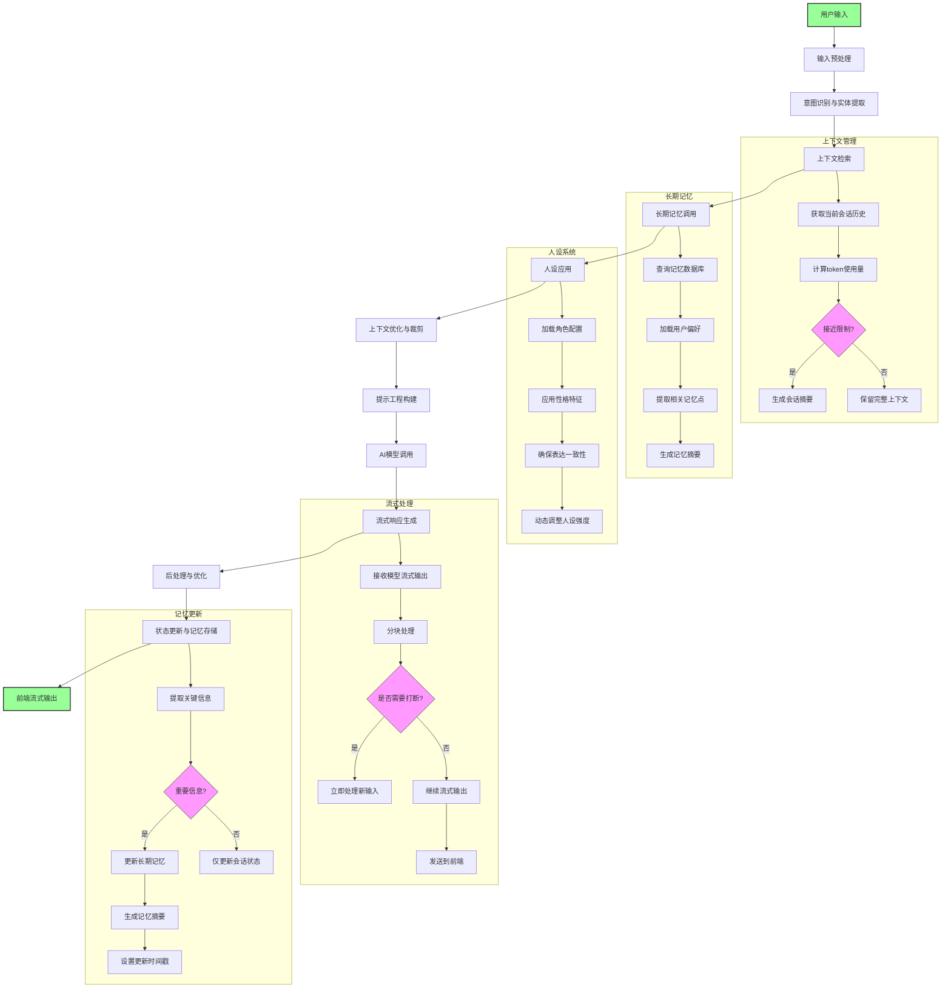

# AI聊天机器人系统功能实现专业规划
## 后端功能实现增强版
   
### 核心架构
使用 java21开发，除了大语言模型直接调用，TTS，VAD，ASR 等实现都通过调用python 的 api接口的方式 实现

#### 微服务架构设计
 - **参数化配置系统**：
   - 分层配置管理：配置文件 > 默认值
   - 热重载机制：配置变更无需重启服务
   - 配置项分类：
     ```yaml
     # 示例配置结构
     system:
       max_context_tokens: 8192
       session_timeout: 3600
       websocket:
         ping_interval: 30
         max_reconnect_attempts: 5
     ai:
       streaming:
         chunk_size: 16
         delay_ms: 50
       voice:
         asr_model: "whisper-medium"
         tts_voice: "zh-CN-XiaoxiaoNeural"
     ```

 - **模块化服务设计**：
   - 会话管理服务：独立处理对话上下文和状态
   - 媒体处理服务：专门处理图像、语音、视频等富媒体
   - 人设管理服务：存储和应用不同机器人的角色设定
   - 记忆服务：实现长期记忆和对话总结功能

 #### 通信机制
 - **WebSocket增强实现**：
   - 消息协议设计：自定义二进制协议，减少传输开销
   - 智能重连策略：指数退避算法，避免服务端过载
   - 消息确认机制：关键消息要求确认，支持失败重试
   - 在线状态管理：实时显示机器人/客服状态，支持状态变更通知

 ### AI核心功能

 #### 基础对话流程
 - **多阶段对话引擎**：
   1. 输入预处理：清理、标准化、意图初步识别
   2. 上下文整合：结合历史对话构建完整上下文
   3. 意图深度分析：多模型融合判断用户真实意图
   4. 响应生成：结合人设、上下文、知识库生成回复
   5. 后处理：敏感词过滤、格式化、流式分块

 - **流式对话实现**：
   - 服务端SSE/WebSocket流式传输
   - 前端增量渲染机制，避免闪烁
   - 流量控制：根据网络状况动态调整分块大小

 #### 上下文管理
 - **智能上下文处理**：
   - 动态上下文裁剪：基于重要性评分保留关键信息
   - 会话摘要技术：当上下文接近限制时自动生成摘要
   - 多粒度记忆：短期记忆(当前会话)与长期记忆(跨会话)

 - **人设功能实现**：
   - 角色定义模板：性格、知识范围、表达风格等维度
   - 一致性维护：确保回复符合设定的人格特征
   - 动态人设调整：根据用户反馈微调机器人性格

 #### 长期记忆系统
 - **对话总结引擎**：
   - 定时触发机制：会话空闲或达到一定长度后触发
   - 多层次总结：关键事实提取、情感分析、关系图谱构建
   - 记忆索引：基于内容的语义索引，便于后续检索

 #### 多模态处理
 - **语音处理流水线**：
   ```mermaid
   graph LR
     A[用户语音输入] --> B(VAD语音活动检测)
     B --> C{是否有效语音?}
     C -->|是| D[ASR语音转文本]
     C -->|否| E[忽略静音]
     D --> F[文本处理]
     F --> G[AI响应生成]
     G --> H[TTS文本转语音]
     H --> I[语音输出]
   ```
   - 支持实时语音打断：VAD检测到新语音立即中断当前输出
   - 语音质量自适应：根据网络状况调整编码质量

 - **图像/视频处理**：
   - 前端上传：支持拖放、拍照、图库选择
   - 后端处理：OCR识别、物体检测、内容审核
   - 混合响应：同时生成文本描述和语音解说

 ### 技术实现优化

 #### 性能优化
 - **消息传输优化**：
   - 消息压缩：对长文本应用Brotli压缩
   - 二进制协议：关键数据使用Protocol Buffers序列化
   - 智能缓存：高频请求结果缓存

 - **资源管理**：
   - 按需加载：大型媒体文件延迟加载
   - 资源预取：预测用户可能请求的内容提前加载
   - 内存管理：对话历史分层存储，冷数据自动归档

 #### 安全与可靠性
 - **输入验证**：
   - 多层过滤：XSS防护、敏感词过滤、内容安全审核
   - 速率限制：防止恶意请求和DDoS攻击

 - **错误处理**：
   - 优雅降级：核心功能优先保障
   - 错误分类：区分用户错误、系统错误、第三方服务错误
   - 自动恢复：关键服务异常自动重启


# 文本处理与AI响应生成流水线详解

## 完整处理流程

以下是我设计的文本处理和AI响应生成流水线，特别强调了人设、长期记忆和上下文的调用机制。该流程经过专业优化，确保对话质量、连贯性和个性化体验。

### 1. 流水线详细步骤

#### 阶段一：输入预处理与分析
1. **输入接收与标准化**
   - 接收用户输入（文本/语音转文本/图像OCR结果）
   - 清洗特殊字符、纠正拼写错误
   - 识别输入类型（问题、命令、闲聊等）

2. **意图识别与实体提取**
   - 使用预训练模型进行意图分类
   - 提取关键实体和参数（时间、地点、人名等）
   - 确定对话状态（新建会话、继续对话、功能调用等）

#### 阶段二：上下文与记忆整合
3. **上下文检索**
   - 从会话管理服务获取当前会话的最近N轮对话
   - 检索短期记忆（当前会话上下文）
   - 计算当前上下文token使用量

4. **长期记忆调用**
   - 查询长期记忆数据库，获取相关记忆摘要
   - 加载用户个性化数据（偏好、历史行为模式）
   - 检索与当前话题相关的过往对话总结

5. **人设应用**
   - 从人设配置加载角色设定（性格、知识范围、表达风格）
   - 应用人设一致性检查器，确保后续生成符合设定
   - 动态调整人设强度（根据对话阶段和用户反馈）

6. **上下文优化与裁剪**
   - 应用智能裁剪算法（基于信息密度评分保留关键内容）
   - 当上下文接近模型限制时，触发会话摘要生成
   - 生成多粒度上下文表示（关键事实、情感倾向、关系网络）

#### 阶段三：提示工程与AI生成
7. **提示工程构建**
   - 组合系统指令、人设描述、上下文和用户输入
   - 应用高级提示技术（思维链、角色扮演、少样本示例）
   - 添加格式化要求和安全过滤规则

8. **AI模型调用与流式处理**
   - 调用LLM API或本地模型，设置适当参数
   - 实现流式响应分块处理（字符级/词级）
   - 实时监控生成内容质量，触发异常处理

9. **后处理与优化**
   - 敏感内容过滤与安全检查
   - 语气调整与表达风格优化（符合人设）
   - 生成富媒体响应建议（如需要图片/视频）

10. **状态更新与记忆存储**
    - 更新会话状态和上下文缓存
    - 触发长期记忆更新（重要信息提取）
    - 记录用户反馈信号用于后续优化

### 2. 流程图




